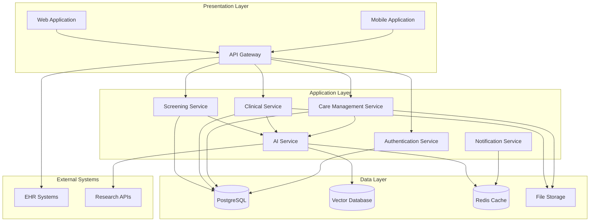

# Design Document: CURA-Autism AI Platform

## Overview

CURA-Autism AI is a comprehensive healthcare platform that leverages artificial intelligence to support the autism care lifecycle from early screening through post-diagnosis care management. The platform is designed as a modular, microservices-based system that serves healthcare professionals, caregivers, and educational staff while maintaining strict human oversight for all medical decisions.

The system architecture follows a three-tier approach:
- **Presentation Layer**: Multi-platform web and mobile interfaces with accessibility compliance
- **Application Layer**: Modular microservices providing AI capabilities, care management, and integration services
- **Data Layer**: Secure, encrypted storage with vector databases for clinical knowledge and synthetic training data

Key design principles include:
- **Human-in-the-loop**: All AI outputs require human validation for medical decisions
- **Privacy-by-design**: Data minimization and synthetic data usage for AI training
- **Explainable AI**: Transparent reasoning for all AI-generated insights
- **Accessibility-first**: WCAG 2.1 AA compliance across all interfaces
- **Interoperability**: Standards-based integration with existing healthcare systems

## Architecture

### System Architecture

The CURA-Autism AI platform follows a microservices architecture deployed on cloud infrastructure with the following core components:



### Deployment Architecture

The platform is designed for cloud-native deployment with the following infrastructure components:

- **Container Orchestration**: Kubernetes for service management and auto-scaling
- **Load Balancing**: Application load balancers with health checks
- **Service Mesh**: Istio for secure service-to-service communication
- **Monitoring**: Prometheus and Grafana for metrics and alerting
- **Logging**: Centralized logging with ELK stack
- **CI/CD**: GitOps-based deployment pipeline with automated testing

### Security Architecture

Multi-layered security approach:
- **Network Security**: VPC with private subnets, WAF protection
- **Identity Management**: OAuth 2.0 with PKCE, multi-factor authentication
- **Data Encryption**: AES-256 encryption at rest, TLS 1.3 in transit
- **Access Control**: Role-based access control (RBAC) with principle of least privilege
- **Audit Logging**: Comprehensive audit trails for all data access and AI decisions

## Components and Interfaces

### Core Services

#### 1. Screening Service
**Purpose**: Manages age-adaptive screening questionnaires and risk assessment

**Key Interfaces**:
```typescript
interface ScreeningService {
  getQuestionnaire(childAge: number): Promise<Questionnaire>
  submitResponses(responses: ScreeningResponse[]): Promise<RiskAssessment>
  getScreeningHistory(userId: string): Promise<ScreeningHistory[]>
}

interface RiskAssessment {
  riskScore: number
  confidenceLevel: number
  explanation: string[]
  recommendations: Recommendation[]
  disclaimers: string[]
}
```

**Dependencies**: AI Service for risk scoring, PostgreSQL for data persistence

#### 2. Clinical Service
**Purpose**: Provides diagnostic decision support for healthcare professionals

**Key Interfaces**:
```typescript
interface ClinicalService {
  uploadPatientNotes(notes: ClinicalNotes): Promise<StructuredSummary>
  analyzeDiagnosticCriteria(patientData: PatientData): Promise<DiagnosticInsights>
  getGuidelineRecommendations(symptoms: Symptom[]): Promise<GuidelineMatch[]>
}

interface DiagnosticInsights {
  criteriaMatches: CriteriaMatch[]
  evidenceLevel: string
  reasoning: string[]
  uncertainties: string[]
  humanReviewRequired: boolean
}
```

**Dependencies**: AI Service for analysis, RAG System for guidelines, Vector DB for knowledge retrieval

#### 3. Care Management Service
**Purpose**: Manages personalized care plans and progress tracking

**Key Interfaces**:
```typescript
interface CareService {
  createCarePlan(childProfile: ChildProfile): Promise<CarePlan>
  updateProgress(planId: string, progress: ProgressUpdate): Promise<void>
  generateInterventionSuggestions(profile: ChildProfile): Promise<Intervention[]>
  getEducationalResources(age: number, topics: string[]): Promise<Resource[]>
}

interface CarePlan {
  id: string
  childProfile: ChildProfile
  interventions: Intervention[]
  milestones: Milestone[]
  careTeam: CareTeamMember[]
  lastUpdated: Date
}
```

**Dependencies**: AI Service for personalization, Vector DB for educational content

#### 4. AI Service
**Purpose**: Provides core AI capabilities across all modules

**Key Interfaces**:
```typescript
interface AIService {
  calculateRiskScore(responses: ScreeningResponse[]): Promise<RiskScore>
  analyzePatientNotes(notes: string): Promise<ClinicalSummary>
  generateCarePlanSuggestions(profile: ChildProfile): Promise<Suggestion[]>
  explainDecision(decisionId: string): Promise<Explanation>
}

interface Explanation {
  reasoning: string[]
  confidenceFactors: ConfidenceFactor[]
  dataPoints: DataPoint[]
  limitations: string[]
}
```

**Dependencies**: Vector DB for knowledge retrieval, Redis for caching, external research APIs

#### 5. RAG System
**Purpose**: Retrieval-Augmented Generation for clinical guidelines and educational content

**Key Interfaces**:
```typescript
interface RAGSystem {
  retrieveGuidelines(query: string): Promise<GuidelineDocument[]>
  generateResponse(context: string, query: string): Promise<GeneratedResponse>
  updateKnowledgeBase(documents: Document[]): Promise<void>
}

interface GuidelineDocument {
  id: string
  title: string
  content: string
  relevanceScore: number
  lastUpdated: Date
  source: string
}
```

**Dependencies**: Vector DB for document storage and retrieval

### Integration Interfaces

#### EHR Integration
```typescript
interface EHRIntegration {
  exportToFHIR(patientData: PatientData): Promise<FHIRBundle>
  importFromFHIR(bundle: FHIRBundle): Promise<PatientData>
  syncPatientData(patientId: string): Promise<SyncResult>
}
```

#### Authentication Service
```typescript
interface AuthService {
  authenticate(credentials: Credentials): Promise<AuthToken>
  authorize(token: string, resource: string): Promise<boolean>
  refreshToken(refreshToken: string): Promise<AuthToken>
  enableMFA(userId: string): Promise<MFASetup>
}
```

## Data Models

### Core Domain Models

#### User and Authentication
```typescript
interface User {
  id: string
  email: string
  role: UserRole
  profile: UserProfile
  mfaEnabled: boolean
  lastLogin: Date
  createdAt: Date
}

enum UserRole {
  PRIMARY_CAREGIVER = 'primary_caregiver',
  CLINICAL_PROFESSIONAL = 'clinical_professional',
  CARE_COORDINATOR = 'care_coordinator',
  HEALTHCARE_ADMIN = 'healthcare_admin'
}

interface UserProfile {
  firstName: string
  lastName: string
  organization?: string
  specialization?: string
  licenseNumber?: string
  preferredLanguage: string
}
```

#### Child and Family Data
```typescript
interface ChildProfile {
  id: string
  dateOfBirth: Date
  gender: string
  primaryCaregiverId: string
  developmentalHistory: DevelopmentalMilestone[]
  medicalHistory: MedicalRecord[]
  screeningHistory: ScreeningResult[]
  currentCarePlan?: string
  privacySettings: PrivacySettings
}

interface DevelopmentalMilestone {
  id: string
  category: MilestoneCategory
  description: string
  expectedAge: number
  actualAge?: number
  status: MilestoneStatus
  notes?: string
  recordedBy: string
  recordedAt: Date
}

enum MilestoneCategory {
  SOCIAL_COMMUNICATION = 'social_communication',
  LANGUAGE = 'language',
  MOTOR_SKILLS = 'motor_skills',
  COGNITIVE = 'cognitive',
  BEHAVIORAL = 'behavioral'
}
```

#### Screening and Assessment
```typescript
interface Questionnaire {
  id: string
  version: string
  ageRange: AgeRange
  questions: Question[]
  scoringCriteria: ScoringCriteria
  validationRules: ValidationRule[]
}

interface Question {
  id: string
  text: string
  type: QuestionType
  options?: QuestionOption[]
  required: boolean
  conditionalLogic?: ConditionalRule[]
}

interface ScreeningResult {
  id: string
  childId: string
  questionnaireId: string
  responses: QuestionResponse[]
  riskAssessment: RiskAssessment
  completedAt: Date
  completedBy: string
}

interface RiskAssessment {
  overallScore: number
  categoryScores: CategoryScore[]
  confidenceLevel: number
  explanation: ExplanationItem[]
  recommendations: Recommendation[]
  followUpRequired: boolean
}
```

#### Clinical Data
```typescript
interface ClinicalNotes {
  id: string
  patientId: string
  authorId: string
  content: string
  structuredData?: StructuredClinicalData
  attachments: Attachment[]
  createdAt: Date
  lastModified: Date
}

interface StructuredClinicalData {
  symptoms: Symptom[]
  observations: Observation[]
  assessments: Assessment[]
  diagnosticCriteria: CriteriaMatch[]
}

interface DiagnosticCriteria {
  id: string
  name: string
  version: string
  criteria: Criterion[]
  scoringMethod: string
}

interface CriteriaMatch {
  criterionId: string
  matched: boolean
  confidence: number
  evidence: Evidence[]
  reasoning: string
}
```

#### Care Management
```typescript
interface CarePlan {
  id: string
  childId: string
  createdBy: string
  careTeam: CareTeamMember[]
  goals: CareGoal[]
  interventions: Intervention[]
  schedule: CareSchedule
  progressTracking: ProgressMetric[]
  status: CarePlanStatus
  createdAt: Date
  lastReviewed: Date
}

interface Intervention {
  id: string
  type: InterventionType
  description: string
  frequency: string
  duration: string
  provider: string
  goals: string[]
  progressMetrics: string[]
  evidenceBase: string[]
}

interface ProgressUpdate {
  id: string
  carePlanId: string
  metricId: string
  value: number | string
  notes?: string
  recordedBy: string
  recordedAt: Date
}
```

#### AI and Knowledge Management
```typescript
interface AIModel {
  id: string
  name: string
  version: string
  type: ModelType
  trainingData: TrainingDataset[]
  performance: ModelPerformance
  biasMetrics: BiasMetric[]
  lastUpdated: Date
}

interface KnowledgeDocument {
  id: string
  title: string
  content: string
  vectorEmbedding: number[]
  metadata: DocumentMetadata
  source: string
  lastUpdated: Date
  reviewStatus: ReviewStatus
}

interface AuditLog {
  id: string
  userId: string
  action: string
  resource: string
  timestamp: Date
  ipAddress: string
  userAgent: string
  outcome: string
  details: Record<string, any>
}
```

### Data Storage Strategy

#### PostgreSQL Schema Design
- **User Management**: Users, roles, permissions, authentication tokens
- **Clinical Data**: Patient records, screening results, clinical notes, care plans
- **System Data**: Audit logs, system configurations, user preferences
- **Relationships**: Proper foreign key constraints and indexes for performance

#### Vector Database Schema
- **Clinical Guidelines**: Embedded diagnostic criteria and treatment guidelines
- **Educational Content**: Age-appropriate resources and intervention strategies
- **Research Literature**: Peer-reviewed articles and evidence-based practices
- **Similarity Search**: Optimized for semantic search and recommendation generation

#### Caching Strategy
- **Redis Clusters**: Session management, frequently accessed data, AI model outputs
- **Cache Invalidation**: Event-driven cache updates for data consistency
- **Performance Optimization**: Reduced database load and improved response times

#### Data Retention and Privacy
- **Retention Policies**: Automated data lifecycle management
- **Anonymization**: Personal data removal while preserving research value
- **Backup Strategy**: Encrypted backups with geographic distribution
- **Compliance**: HIPAA, GDPR, and other healthcare privacy regulations

## Correctness Properties

*A property is a characteristic or behavior that should hold true across all valid executions of a system—essentially, a formal statement about what the system should do. Properties serve as the bridge between human-readable specifications and machine-verifiable correctness guarantees.*

Based on the requirements analysis, the following correctness properties ensure the CURA-Autism AI platform operates reliably and safely across all scenarios:

### Core Functionality Properties

**Property 1: Age-appropriate questionnaire delivery**
*For any* valid child age, the screening module should return a questionnaire that matches the appropriate age range criteria for that child
**Validates: Requirements 1.1**

**Property 2: Risk score generation completeness**
*For any* valid screening responses, the AI service should generate a risk assessment with a score within expected bounds (0-100) and non-empty explanation
**Validates: Requirements 1.2**

**Property 3: AI explanation transparency**
*For any* AI-generated output (risk scores, clinical insights, care suggestions), the system should provide clear, non-empty explanations of the reasoning process
**Validates: Requirements 1.3, 2.3, 4.1**

**Property 4: High-risk recommendation provision**
*For any* screening result with elevated risk score (above threshold), the platform should include specific next-step recommendations including professional consultation
**Validates: Requirements 1.4**

**Property 5: Medical disclaimer presence**
*For any* screening result or diagnostic support display, the platform should include clear disclaimers about tool limitations and human decision authority
**Validates: Requirements 1.5, 2.4**

**Property 6: Clinical note processing completeness**
*For any* valid clinical notes uploaded, the clinical module should produce a structured summary with identified symptoms, observations, and assessments
**Validates: Requirements 2.1**

**Property 7: Diagnostic criteria cross-referencing**
*For any* patient data analysis, the AI service should perform symptom matching against established diagnostic criteria and provide criteria match results
**Validates: Requirements 2.2**

**Property 8: Clinical guideline retrieval relevance**
*For any* clinical guideline query, the RAG system should retrieve documents with relevance scores above minimum threshold and current publication dates
**Validates: Requirements 2.5**

**Property 9: Personalized care plan generation**
*For any* child profile, the care module should generate intervention suggestions that are specific to the child's age, developmental stage, and documented needs
**Validates: Requirements 3.1**

**Property 10: Progress tracking capability**
*For any* valid progress data (milestones, behavioral changes), the platform should successfully log the information with proper timestamps and attribution
**Validates: Requirements 3.2**

**Property 11: Care plan modification suggestions**
*For any* care plan with recorded progress data, the AI service should analyze effectiveness and generate specific modification suggestions when progress indicates need
**Validates: Requirements 3.3**

**Property 12: Age-appropriate educational content**
*For any* age-based content request, the care module should return resources that match the specified age range and developmental appropriateness criteria
**Validates: Requirements 3.4, 10.1**

**Property 13: Care team communication facilitation**
*For any* care team configuration, the platform should establish communication channels that allow all team members to share updates and coordinate care
**Validates: Requirements 3.5**

### AI Transparency and Safety Properties

**Property 14: AI confidence and uncertainty indicators**
*For any* AI-generated insight or recommendation, the platform should include confidence levels, uncertainty indicators, and clear human decision points
**Validates: Requirements 4.3, 4.4**

### Security and Privacy Properties

**Property 15: Multi-factor authentication enforcement**
*For any* user account creation, the platform should require and successfully configure multi-factor authentication before account activation
**Validates: Requirements 5.1**

**Property 16: Data encryption verification**
*For any* patient data storage or transmission, the system should use encryption protocols (AES-256 at rest, TLS 1.3 in transit) and verify encryption status
**Validates: Requirements 5.2**

**Property 17: Comprehensive audit logging**
*For any* patient data access, AI prediction, or system error, the platform should create detailed logs with user identification, timestamps, and action details
**Validates: Requirements 5.3, 9.1, 9.2**

**Property 18: Data deletion completeness**
*For any* user data deletion request, the platform should permanently remove all associated personal information within the specified 30-day timeframe
**Validates: Requirements 5.4**

### Cross-Platform and Accessibility Properties

**Property 19: Cross-platform functionality consistency**
*For any* core platform feature, the functionality should work consistently across web browsers, mobile devices, and accessibility tools while meeting WCAG 2.1 AA standards
**Validates: Requirements 6.1, 6.3**

**Property 20: Offline capability preservation**
*For any* essential screening function, the platform should maintain functionality during limited connectivity scenarios with local data storage and sync capabilities
**Validates: Requirements 6.2**

**Property 21: Multi-language content support**
*For any* user interface element or educational content, the platform should support multiple language displays with proper character encoding and cultural appropriateness
**Validates: Requirements 6.4**

**Property 22: Mobile performance optimization**
*For any* mobile device access under low-bandwidth conditions, the platform should maintain acceptable performance with optimized resource loading and caching
**Validates: Requirements 6.5**

### Integration and Interoperability Properties

**Property 23: Healthcare data format compliance**
*For any* EHR integration or data export, the platform should successfully process and generate standard healthcare formats (HL7 FHIR) with proper validation
**Validates: Requirements 7.1, 7.2**

**Property 24: External data validation**
*For any* imported external data, the platform should validate format, sanitize content, and reject invalid or potentially harmful data
**Validates: Requirements 7.3**

**Property 25: Data synchronization consistency**
*For any* multi-system synchronization operation, the platform should maintain data consistency across all connected systems with conflict resolution
**Validates: Requirements 7.4**

**Property 26: API security enforcement**
*For any* API access request, the platform should enforce authentication, authorization, and rate limiting while providing secure endpoints
**Validates: Requirements 7.5**

### Performance Properties

**Property 27: Screening performance requirements**
*For any* screening request, the AI service should return risk assessments within 30 seconds while maintaining accuracy standards
**Validates: Requirements 8.1**

**Property 28: Concurrent user performance**
*For any* system load scenario, the platform should maintain response times under 3 seconds for 95% of requests during concurrent user access
**Validates: Requirements 8.2**

**Property 29: Auto-scaling effectiveness**
*For any* system load increase, the platform should automatically scale resources and maintain performance standards without service degradation
**Validates: Requirements 8.3**

**Property 30: AI processing performance**
*For any* clinical note analysis, the AI service should process documents and generate summaries within 2 minutes regardless of document complexity
**Validates: Requirements 8.4**

**Property 31: Database query performance**
*For any* clinical guideline retrieval query, the vector database should return results within 1 second while maintaining relevance accuracy
**Validates: Requirements 8.5**

### Quality Assurance Properties

**Property 32: Issue tracking and feedback management**
*For any* user-reported issue or system feedback, the platform should provide tracking mechanisms and maintain issue resolution workflows
**Validates: Requirements 9.3**

**Property 33: Compliance reporting capability**
*For any* regulatory audit request, the platform should generate comprehensive compliance reports containing all required audit trail information
**Validates: Requirements 9.4**

**Property 34: Performance monitoring completeness**
*For any* system operation, the platform should track and report key metrics including accuracy, response times, user satisfaction, and system health
**Validates: Requirements 9.5**

### Educational Content Properties

**Property 35: Peer-reviewed content retrieval**
*For any* educational content search, the RAG system should retrieve materials that are peer-reviewed, evidence-based, and relevant to the search criteria
**Validates: Requirements 10.2**

**Property 36: Content accessibility and readability**
*For any* educational content display, the platform should present information in accessible, non-technical language appropriate for the target audience
**Validates: Requirements 10.3**

**Property 37: Learning resource management**
*For any* caregiver interaction with educational resources, the care module should support bookmarking, organization, and progress tracking functionality
**Validates: Requirements 10.4**

**Property 38: Content currency maintenance**
*For any* new research integration, the platform should update educational content to reflect current best practices within defined update cycles
**Validates: Requirements 10.5**

## Error Handling

### Error Classification and Response Strategy

The CURA-Autism AI platform implements a comprehensive error handling strategy that prioritizes patient safety and system reliability:

#### Critical Errors (System-Level Failures)
- **AI Service Failures**: When AI models fail to generate outputs, the system falls back to rule-based alternatives and alerts clinical staff
- **Data Corruption**: Automatic data integrity checks with rollback capabilities and immediate administrator notification
- **Security Breaches**: Immediate system lockdown, audit trail preservation, and automated incident response protocols

#### Operational Errors (Service-Level Issues)
- **Integration Failures**: Graceful degradation with cached data and retry mechanisms for EHR connectivity issues
- **Performance Degradation**: Auto-scaling triggers and load balancing with user notification of potential delays
- **Validation Errors**: Clear user feedback with specific guidance for data correction

#### User Errors (Input and Interaction Issues)
- **Invalid Data Entry**: Real-time validation with helpful error messages and input suggestions
- **Authentication Failures**: Progressive security measures with account lockout protection and recovery options
- **Access Violations**: Clear permission explanations and appropriate access request workflows

### Error Recovery Mechanisms

#### Automated Recovery
```typescript
interface ErrorRecoveryService {
  handleCriticalError(error: CriticalError): Promise<RecoveryResult>
  implementFallbackStrategy(service: string): Promise<FallbackResult>
  escalateToHuman(error: Error, context: ErrorContext): Promise<void>
}
```

#### Human-in-the-Loop Error Resolution
- **Clinical Errors**: Immediate escalation to healthcare professionals with full context
- **AI Uncertainty**: Clear uncertainty indicators with human review requirements
- **Data Quality Issues**: Expert review workflows with data correction capabilities

#### Error Monitoring and Learning
- **Pattern Recognition**: ML-based error pattern detection for proactive prevention
- **Root Cause Analysis**: Automated error correlation and impact assessment
- **Continuous Improvement**: Error data integration into system enhancement cycles

## Testing Strategy

### Dual Testing Approach

The CURA-Autism AI platform requires both unit testing and property-based testing to ensure comprehensive coverage and reliability in a healthcare context.

#### Property-Based Testing Strategy

**Primary Focus**: Universal properties that must hold across all inputs and scenarios
- **Minimum 100 iterations** per property test due to the critical nature of healthcare applications
- **Comprehensive input generation** including edge cases, boundary conditions, and adversarial inputs
- **Healthcare-specific generators** for clinical data, patient profiles, and medical scenarios

**Property Test Configuration**:
- Each property test references its corresponding design document property
- Tag format: **Feature: cura-autism-ai, Property {number}: {property_text}**
- Custom generators for healthcare data types (ages, medical records, clinical notes)
- Shrinking strategies optimized for healthcare data to find minimal failing examples

**Example Property Test Structure**:
```typescript
// Feature: cura-autism-ai, Property 1: Age-appropriate questionnaire delivery
test('age-appropriate questionnaire delivery', async () => {
  await fc.assert(fc.asyncProperty(
    fc.integer({ min: 0, max: 18 }), // Child age generator
    async (childAge) => {
      const questionnaire = await screeningService.getQuestionnaire(childAge);
      expect(questionnaire.ageRange.min).toBeLessThanOrEqual(childAge);
      expect(questionnaire.ageRange.max).toBeGreaterThanOrEqual(childAge);
      expect(questionnaire.questions).not.toHaveLength(0);
    }
  ), { numRuns: 100 });
});
```

#### Unit Testing Strategy

**Complementary Focus**: Specific examples, edge cases, and integration points
- **Healthcare compliance scenarios**: HIPAA, accessibility, and regulatory requirements
- **Error condition testing**: Invalid inputs, system failures, and security violations
- **Integration testing**: EHR connectivity, external API interactions, and data synchronization
- **Clinical workflow testing**: End-to-end care pathways and professional decision points

**Unit Test Categories**:
1. **Regulatory Compliance Tests**: WCAG accessibility, HIPAA privacy, data retention policies
2. **Clinical Safety Tests**: AI explanation requirements, human oversight validation, disclaimer presence
3. **Integration Tests**: FHIR data exchange, EHR synchronization, external system connectivity
4. **Performance Tests**: Response time validation, concurrent user handling, resource scaling
5. **Security Tests**: Authentication flows, data encryption, audit logging, access controls

#### Testing Framework Selection

**Property-Based Testing**: 
- **JavaScript/TypeScript**: fast-check library for comprehensive property testing
- **Python**: Hypothesis library for healthcare data generation and testing
- **Configuration**: Minimum 100 iterations per test, custom healthcare data generators

**Unit Testing**:
- **JavaScript/TypeScript**: Jest with healthcare-specific matchers and mocks
- **Python**: pytest with healthcare data fixtures and compliance validators
- **Integration**: Testcontainers for database and external service testing

#### Healthcare-Specific Testing Considerations

**Data Privacy Testing**:
- Synthetic data validation for AI training
- Personal information scrubbing verification
- Data retention and deletion compliance

**Clinical Safety Testing**:
- AI explanation completeness and clarity
- Human decision point validation
- Medical disclaimer presence and accuracy

**Accessibility Testing**:
- WCAG 2.1 AA compliance validation
- Screen reader compatibility
- Multi-language support verification

**Performance Testing**:
- Healthcare-critical response time requirements
- Concurrent user load testing for clinical environments
- Auto-scaling validation under varying loads

#### Continuous Testing Integration

**CI/CD Pipeline Integration**:
- Automated property test execution on all code changes
- Healthcare compliance validation in deployment pipeline
- Performance regression testing with healthcare-specific benchmarks

**Monitoring and Alerting**:
- Real-time test failure notifications for critical healthcare functions
- Performance degradation alerts with clinical impact assessment
- Compliance violation detection and automatic remediation triggers

This comprehensive testing strategy ensures that the CURA-Autism AI platform maintains the highest standards of reliability, safety, and compliance required for healthcare applications while providing thorough validation of both specific scenarios and universal system properties.